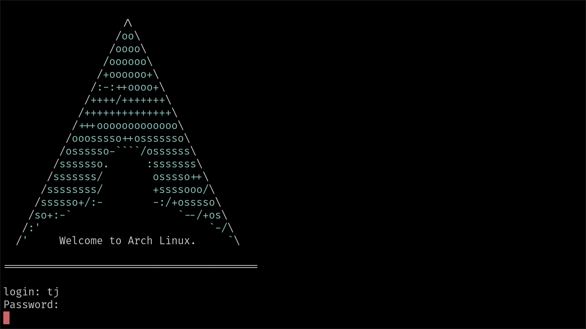

# Arch login banner
A colored Arch Linux banner for `/etc/issue`

## Installation

`sudo make install`

## Preview

preview the banner with rendered escape codes using `less -rf arch.txt | cat`
**NOTE:** backslashes are rendered differently by the login shell and should appear correctly, unlike previewing via `less`
